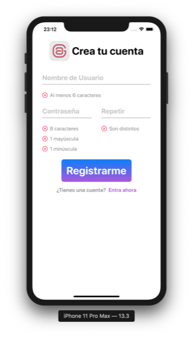
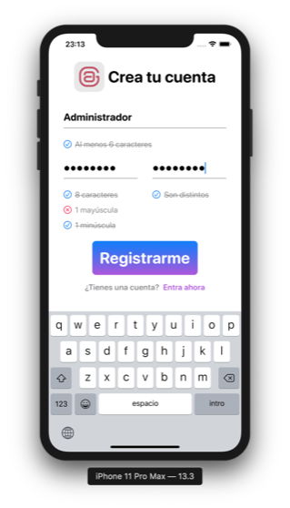

# combineSignUp
||A reactive SignUp validation Form using Combine and SwiftUI in MVVM|
|-|-|
## Changelog 
### 1.0.0 MVVM is ready and working with Combine framework!
The **View** now is using:
- [x] Basic Form displaying a sign up screen
- [x] An `@ObservedObject` instead `@State`
- [x] A ViewModel instance where do all the necessary logic to validations:
`@ObservedObject private var viewModel = SignUpViewModel()`

The **ViewModel** is using:
- [x] `@Published` vars
- [x] `.range(of:options:)` with a RegEx pattern
- [x] A class that conforms `: ObservableObject` protocol
- [x] Doing all the magic in the `init()`, ViewModel is a `class`
  1. `.receive(on:)` for the suscriber receive change, on main for visual changes 
  2. `.map{ username in … }` to make the necessary transformations in data
  3. `.assign(to:on:)` assign it to the corresponding var that will be published
  4. `.store(in:)`store the @Published reference in the `cancellableObjects: Set<AnyCancellable>` (needs Combine import)
##### Screenshots
||||
|-|-|-|
||||
