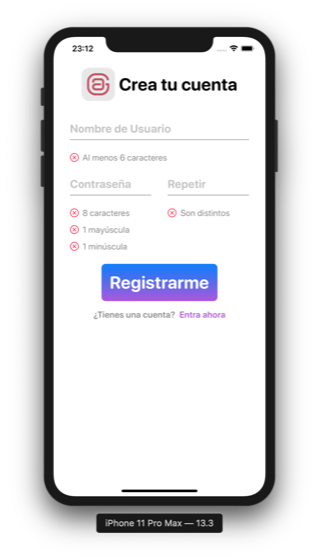

# combineSignUp
||A reactive SignUp validation Form using Combine and SwiftUI in MVVM|
|-|-|
## Changelog 
#### 1.0.0
- [x] Basic Form displaying a sign up screen
- [x] Validation design
- [ ] Form design
##### Screenshots
||||
|-|-|-|
